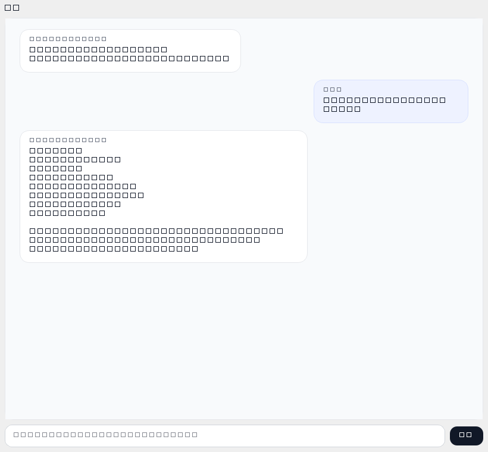

# TrafficAgent

TrafficAgent 是一个面向 Windows 的 SUMO 桌面应用，目标是把“场景创建、参数调整、项目生成、仿真运行”整合进一个聊天式工作流里。

当前仓库已经包含：

- 基于 PySide6 的桌面界面
- 本地项目与配置存储
- 路网、路线、仿真配置生成
- 基于 TraCI 的 SUMO 仿真控制
- 基于 AutoGen 的助手编排与工具调用
- 兼容 OpenAI-style API 的模型接入
- 路口图片分析草稿能力



## 当前状态

项目目前处于 alpha 阶段。

- 主要目标平台：Windows
- 推荐 Python 版本：3.11
- 推荐环境管理方式：Conda / Anaconda
- 外部运行依赖：SUMO、`sumo` / `sumo-gui`、`netconvert`、TraCI

## 主要功能

- 在 `workspace/projects/` 下创建和管理本地 SUMO 项目
- 生成基础路网、车流路线和仿真配置文件
- 在运行前对项目文件进行校验
- 在桌面界面中启动、暂停、恢复、单步执行和停止仿真
- 本地保存最近项目、用户偏好和模型配置
- 通过 AutoGen + OpenAI-compatible 模型接口驱动助手能力
- 上传路口图片并生成可继续编辑的结构化草稿

示例资源：

- 界面截图：`artifacts_chat_layout.png`
- 路口样例图：`artifacts/e2e_intersection_sample.png`

## 助手架构

当前助手链路已经切到 AutoGen，整体结构如下：

- `ui/`：PySide6 桌面界面与后台任务线程
- `agent/`：AutoGen 桥接、提示词、记忆、工具规划与回退规则
- `model_providers/`：基于 `OpenAIChatCompletionClient` 的模型适配层
- `sumo_tools/`：场景、路网、路线、仿真配置生成
- `sim_runner/`：SUMO 进程控制与 TraCI 运行控制

当前 `AgentOrchestrator` 的执行顺序为：

1. 本地快捷回复
2. AutoGen 规划回复和工具调用
3. 本地工具执行与结果汇总
4. AutoGen 失败时回退到本地规则解析

## 快速开始

### 1. 创建 Conda 环境

```powershell
conda env create -f environment.yml
conda activate traffic-agent
```

如果你更希望使用仓库内的本地环境：

```powershell
conda env create -f environment.yml -p .\.conda
conda activate .\.conda
```

### 2. 验证 Python 侧依赖

```powershell
python -c "import PySide6, pydantic, autogen_agentchat, autogen_ext; print('python deps ok')"
```

### 3. 安装并配置 SUMO

请先单独安装 SUMO，然后在当前 PowerShell 会话中配置其可执行文件和 Python 工具路径：

```powershell
$env:SUMO_HOME = "C:\Program Files\Eclipse\Sumo"
$env:PATH = "$env:SUMO_HOME\bin;$env:PATH"
$env:PYTHONPATH = "$env:SUMO_HOME\tools;$env:PYTHONPATH"
```

如果你的 SUMO 安装路径不同，请自行替换。

详细说明见：[docs/setup-windows.md](./docs/setup-windows.md)

### 4. 启动应用

```powershell
python app\main.py
```

首次启动后，程序会自动创建以下本地运行目录和文件：

- `.traffic_agent/config/`
- `.traffic_agent/traffic_agent.db`
- `workspace/projects/`

## 模型配置

程序会将模型设置保存在 `.traffic_agent/config/model_config.json`。

可以通过两种方式配置：

- 启动程序后，在设置窗口中填写
- 参考 [docs/model_config.example.json](./docs/model_config.example.json) 手动创建配置文件

配置字段说明：

- `base_url`：OpenAI-compatible API 基地址
- `api_key`：服务提供方的 API Key
- `model`：聊天模型名称
- `supports_vision`：是否将当前模型视为支持图像能力
- `temperature`：生成温度
- `timeout_seconds`：请求超时时间

说明：

- 当前代码通过 AutoGen 调用模型，但底层仍要求提供兼容 OpenAI-style API 的服务端
- 文本和图片能力都复用同一份模型配置；是否支持图片由 `supports_vision` 控制

## 目录结构

```text
app/                应用入口与启动装配
agent/              AutoGen 桥接、提示词、记忆、工具规划与规则回退
model_providers/    OpenAI-compatible 模型客户端与 AutoGen 适配
sim_runner/         SUMO 进程与 TraCI 运行控制
storage/            本地配置、历史与项目存储
sumo_domain/        Pydantic 领域模型
sumo_tools/         SUMO 文件生成与校验工具
ui/                 PySide6 桌面界面
artifacts/          示例图片与演示资源
docs/               安装与配置文档
workspace/projects/ 本地生成的项目目录
```

## 外部依赖说明

本仓库不会内置 SUMO 本体。

如果你希望完整运行仿真，需要满足以下条件：

- 已正确安装 SUMO
- `sumo` 或 `sumo-gui` 已加入 `PATH`
- `netconvert` 已加入 `PATH`
- Python 可以导入 TraCI，通常需要把 `SUMO_HOME/tools` 加入 `PYTHONPATH`

当 `netconvert` 不可用时，部分流程会退化为写入占位 `.net.xml` 文件，但这不能替代真实可运行的 SUMO 工具链。

## 开发说明

- 本地运行数据默认不会提交到 Git：`.conda/`、`.tmp/`、`.traffic_agent/`、`workspace/projects/*`
- 仓库中的 `docs/` 目录提供公开文档；内部协作记录和本机环境文件已排除出公开跟踪范围
- 当前代码库以 Windows 本地源码运行方式为主，尚未打包为安装程序

## 后续方向

当前更适合作为源码仓库使用，后续可继续补充：

- 自动化测试
- CI 配置
- 安装器或打包发布流程
- 贡献指南与安全策略文档

## License

本项目基于 MIT License 开源，详见 [LICENSE](./LICENSE)。
